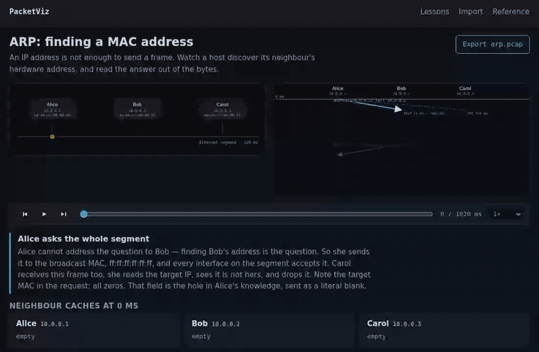
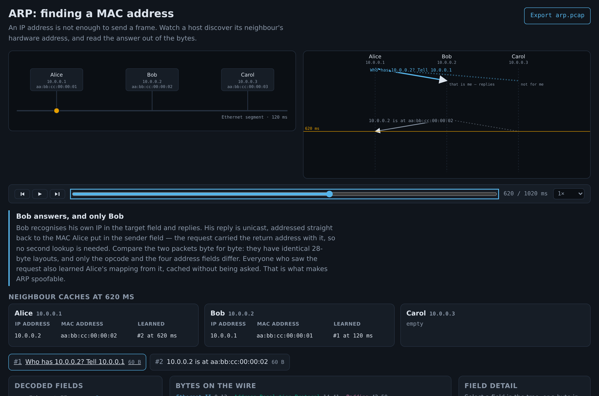
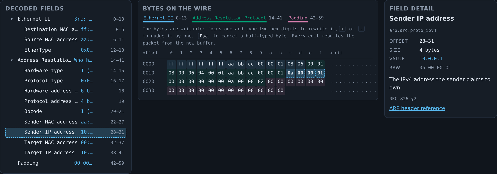
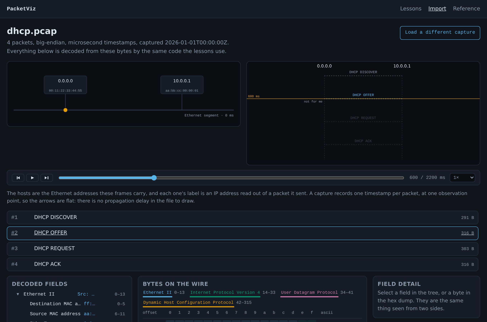
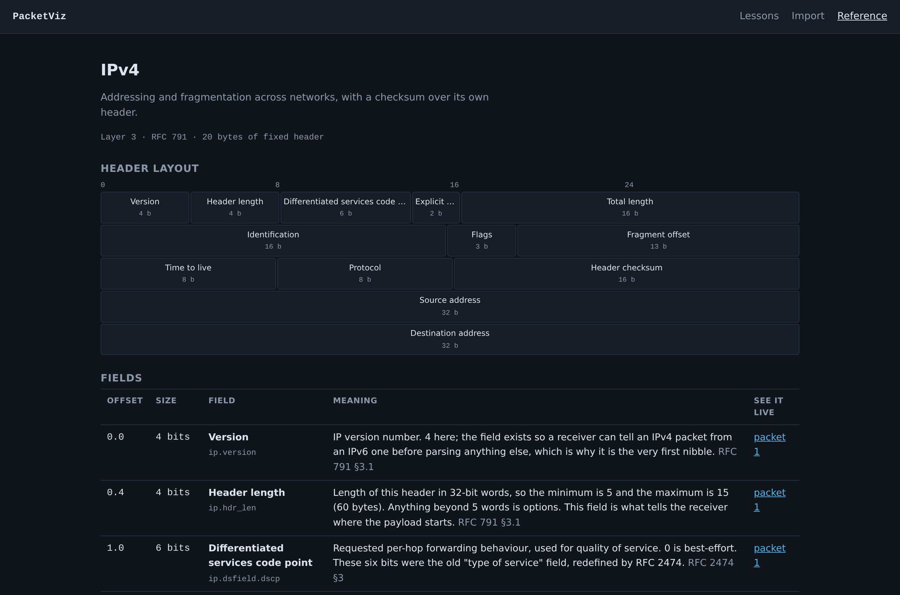
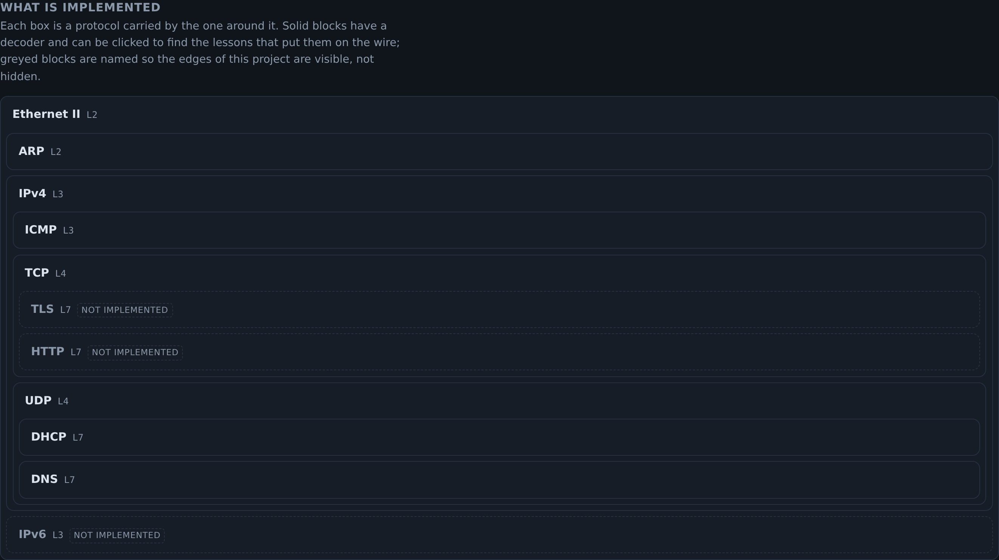
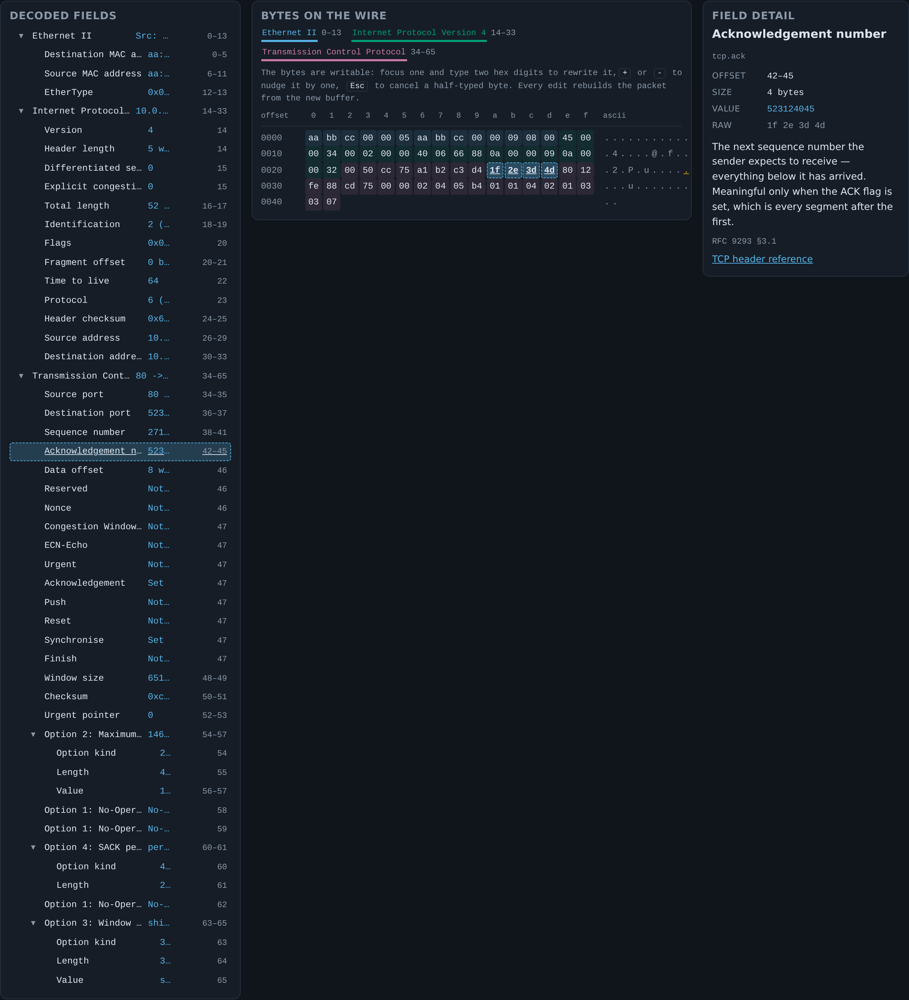
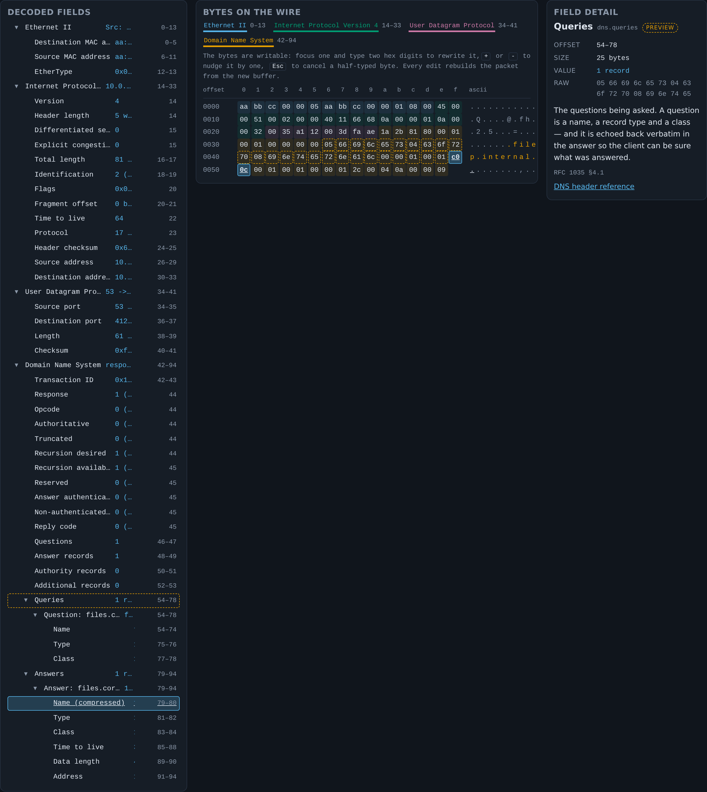

# PacketViz

[](https://github.com/icyyolo/packetViz/actions/workflows/ci.yml)

**One packet, four ways to look at it — and every one of them is the same bytes.**

**Live: <https://icyyolo.github.io/packetViz/>**



A network packet is usually taught twice and never joined up: a diagram of
boxes, and a hex dump. PacketViz shows the segment, the ladder diagram, the
decoded field tree and the raw bytes at once, and links the last two in both
directions — click `Opcode` and its bytes light up; click a byte and its field
lights up.

The GIF above is the whole design argument. One byte is typed into the hex grid,
and the field tree, the ladder's labels and the topology all change, because
none of them ever had their own copy of anything:

> **There is exactly one source of truth per packet: a `Uint8Array` produced by
> an encoder written against the wire format. All four layers are decodes or
> projections of that buffer.**

Ethernet, ARP, IPv4, ICMP, TCP, UDP, DHCP and DNS, done to the byte.
`ARCHITECTURE.md` explains
how that invariant is enforced (a lint rule, a grep test and a writable hex
grid), why the decoder is declarative but the encoders are not, and why
Wireshark is in CI.

## What is in it

| | |
|---|---|
|  | **Four layers, one buffer.** Topology, ladder, field tree, hex — all `f(t)` over a virtual clock you can scrub, step and seek. |
|  | **Bidirectional field ↔ byte linking**, checked exhaustively by Playwright: every leaf field of every packet, in both directions. |
|  | **Open your own `.pcap`.** Wireshark and tcpdump captures decode in the same four layers; the hosts are derived from the frames' own addresses. |
|  | **A generated protocol reference.** Header diagrams, field tables and value dictionaries, produced from the same spec tables the decoder runs. |
|  | **A concept map that cannot lie.** "Implemented" means a decoder is registered where that protocol would be dispatched — unregister one and its block greys out. |
|  | **State between packets.** The acknowledgement number is the client's initial sequence number plus one, because a SYN consumes a sequence number without carrying data. Read out of two packets' bytes, asserted as such. |
|  | **A field whose value is not in the field.** Two bytes selected in the hex grid; nineteen characters of name in the tree. That is DNS pointer compression, and it is the one comparison against Wireshark made on a decoded value rather than on raw bytes. |

Six lessons: [ARP](https://icyyolo.github.io/packetViz/#/lesson/arp),
[ARP spoofing](https://icyyolo.github.io/packetViz/#/lesson/arp-spoofing),
[DHCP](https://icyyolo.github.io/packetViz/#/lesson/dhcp),
[ping](https://icyyolo.github.io/packetViz/#/lesson/ping),
[the TCP handshake](https://icyyolo.github.io/packetViz/#/lesson/tcp-handshake)
and [DNS](https://icyyolo.github.io/packetViz/#/lesson/dns).

## The correctness proof

The claim is not "the decoder looks right". It is:

> Any lesson exports a real `.pcap` that Wireshark opens cleanly and decodes to
> the same values PacketViz shows — checked on every commit, field for field.

Run it yourself:

```bash
sudo apt install tshark        # the oracle, plus text2pcap and editcap
npm ci
npm test
```

That runs, among 338 tests:

* **The Wireshark differential.** Every capture is written to a temp file, read
  by `tshark -T json`, and compared field for field against our decode — with a
  coverage assertion that fails if a field we emit has no entry in the mapping
  table. Checksum validation is forced on, so IPv4, UDP and TCP checksums must
  come back `Good` rather than "unchecked". Six captures go through it, and the
  divergences are pinned rather than papered over: Wireshark shows TCP sequence
  numbers relative to each side's first one, so `tcp.seq` maps to its
  `tcp.seq_raw`, and it hides the DNS flag bits that only mean something in a
  response, so those mappings are marked as sometimes absent — with the reason.
* **Round-trip property tests.** 1,000 generated cases each for ARP, the DORA
  exchange, ICMP echo, a TCP segment with options, and a DNS answer whose name
  is a compression pointer: encode, decode, compare.
* **The totality fuzz test.** Thousands of hostile buffers plus named
  adversarial cases (a zero-length DHCP option, an IPv4 IHL below 5, a UDP
  length larger than the frame, an option list with no terminator, a TCP data
  offset below the minimum, and a DNS name that points at itself). No throw, no
  hang, no unbounded allocation — and removing one bounds check makes it fail.
* **A foreign capture.** `editcap` rewrites our capture in the other byte order,
  and `text2pcap` builds frames from a hex dump typed into the test file — bytes
  that never touched our encoders. Both are read back and compared with tshark
  on the very same file.

Without `tshark` on PATH those tests skip with a loud warning; CI sets
`REQUIRE_TSHARK=1`, which turns a skip into a failure.

The browser gates:

```bash
npx playwright install --with-deps chromium
npm run e2e
```

45 tests, including an exhaustive sweep of the field ↔ byte link (575
field-to-byte and 397 byte-to-field assertions) and a set of RFC offsets typed
by hand — because a sweep whose expectations come from our own decoder proves
the UI and the codec agree, not that either is right.

That sweep is also what found the last real bug: a TCP SYN carries three
No-Operation options, all with the field id `tcp.opt.1`, and selection stored an
id alone. Clicking the third one highlighted the first one's byte. Selection is
now an id and an occurrence.

## Adding a lesson

Written from what actually happened building the DHCP lesson.

1. **Build the frames in `src/core`, not in the lesson.** If the exchange needs
   a message your encoders cannot produce, that is a codec change first. The
   builders live beside the protocol (`buildDhcpDiscoverFrame` and friends in
   `src/core/protocols/dhcp.ts`) and take scene inputs — a client MAC, a lease —
   never protocol constants.
2. **Write `src/lessons/<slug>/scenario.ts`** with hosts, `linkDelayMs` and one
   `PacketEvent` per transmission, each with a `build()` returning bytes. If you
   find yourself typing `0x0806`, a port number or an option code here, stop —
   `tests/scenario.test.ts` will fail, and it is right.
3. **Write `narration.ts`**: an intro plus one step per packet. Bind prose to
   *what is on screen*, not to what you expect the reader to infer. The DHCP
   narration originally told the reader to compare the ACK with the Offer; the
   diff pane compares against the previous packet. A DOM test caught the prose,
   not the code.
4. **Register it in `src/lessons/index.ts`** — slug, title, blurb, filename.
   Packet counts and protocol badges are computed by compiling the scenario, so
   there is nothing else to declare.
5. **Add the capture to the differential** in `tests/tshark-diff.test.ts` and
   let Wireshark tell you what you got wrong. Expect it to have an opinion.

## Adding a protocol

1. **A `FieldSpec` table** in `src/core/protocols/<name>.ts`: id, name, bits,
   renderer, description, RFC reference, and a `values` dictionary if the field
   is enumerated. The description is required — the field tree, the detail panel
   and the reference page all read it, so a field cannot ship unexplained.
2. **An encoder** using `ByteWriter`, and a `decode` that runs the spec and adds
   whatever the table cannot express (a checksum verification, a TLV loop). Keep
   the totality contract: clamp every length taken from the frame, and make
   every loop advance.
3. **A registry entry** in `src/core/registry.ts`, plus the dispatch key that
   reaches it (an EtherType, an IP protocol number, a port). Registration is
   what "implemented" means: the concept map and the reference pages derive it,
   so there is no second place to update.
4. **A row in the tshark mapping table** in `tests/tshark.ts`. The coverage
   assertion fails until every leaf field you emit is mapped, which is the
   point.
5. **Extend the fuzz seeds** with a frame of the new protocol, and the
   round-trip property test if it has an encoder.

## Running it

```bash
npm run dev       # vite dev server
npm test          # unit, property, fuzz and Wireshark differential
npm run e2e       # Playwright, chromium only
npm run lint      # oxlint, including the views -> lessons ban
npm run build     # tsc -b && vite build
npm run media     # regenerate docs/media (deterministic)
```

## Not built, and why it would be next

Ordered by what each would actually teach, not by effort:

1. **TCP with data and teardown** — the handshake is here; a data segment and a
   FIN exchange would show sequence numbers advancing by payload length, which
   is the half of TCP the three-packet lesson only implies.
2. **TLS** — the protocol almost every TCP stream is wrapped in. A ClientHello
   is readable without any cryptography, and it is where the encapsulation map
   currently stops.
3. **IPv6** — a second network layer would test whether the dispatch chain is
   really as generic as it claims, since UDP's pseudo-header changes shape.
4. **More lessons on protocols already implemented** — gratuitous ARP, ARP
   probe/announce, DHCP renewal (unicast REQUEST), DHCP NAK, a DNS answer with
   several records. Near-zero core cost.

The rule that kept this project from becoming a list of half-decoded protocols:
nothing from that list starts until the existing lessons pass every gate above.
